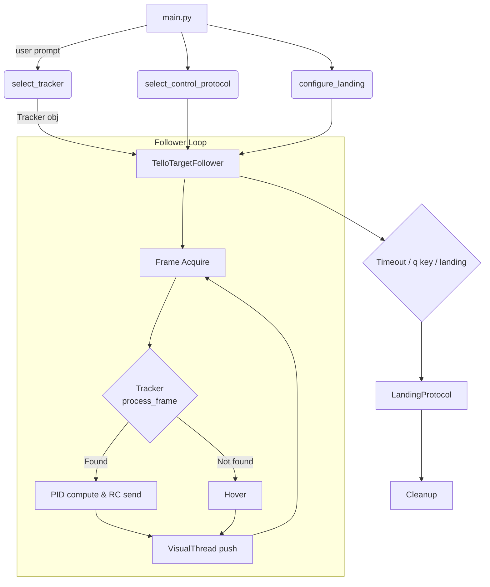

# Tello Autonomous Flight Framework

[](https://deepwiki.com/username/repository)

A modular Python project for vision‑guided autonomous flight, precision landing, and data logging on DJI Tello / Tello EDU drones.

---
[](https://deepwiki.com/username/repository)


## ✨ Features

| Area                | Highlights                                                                                                  |
| ------------------- | ----------------------------------------------------------------------------------------------------------- |
| **Vision Tracking** | Mission Pad, colour patch, rectangles, pentagon/triangle/star/circle *plus* robust **ArUco marker** tracker |
| **Control**         | Proportional, PI, and anti‑wind‑up PID controllers with velocity clamping                                   |
| **Landing**         | Simple or multi‑layer landing with **IMU stability check**                                                  |
| **Visualisation**   | OpenCV GUI or head‑less logger, pushed via a background visual‑thread so control is never blocked           |
| **Safety**          | Exception‑safe loops, automatic hover on tracking loss, timeout failsafe                                    |
| **Tooling**         | Structured logging, unit tests (pytest + coverage), GitHub CI workflow                                      |

---

## 🗂️ Directory Layout

```text
connectors/          ↳ drone connection helpers
trackers/            ↳ vision trackers (MissionPad, ArUco …)
control_protocols/   ↳ P, PI, PID control laws
landing_protocols/   ↳ landing strategies (simple, multilayer)
visual_protocols/    ↳ GUI & logger, plus VisualThread helper
utils/               ↳ logging + misc helpers
main.py              ↳ entry‑point orchestrator
tests/               ↳ unit tests
```

---

## 🚀 Quick Start

```bash
# 1.  Clone & install
python -m venv venv && source venv/bin/activate
pip install -r requirements.txt

# 2.  Connect the drone and run
python main.py   # follow on‑screen prompts
```

> **Tip:** Printing an ArUco (DICT\_4X4\_50, id 0) gives the most reliable indoor tracking.

---

## 🛠️ Developer Guide

### Run unit tests

```bash
pytest -q                        # all fast tests
coverage run -m pytest && coverage report
```

### Continuous Integration

A GitHub Actions workflow (`.github/workflows/ci.yml`) installs deps, runs pytest + coverage and uploads a Codecov report.

### Logging

All modules share a central logger – see `utils/logging_utils.py`.  Logs go to **drone.log** *and* stdout.

### Extending Trackers

Create a new class that derives from `TrackerBase`, implement `process_frame()`, then add it to `utils/setup_utils.select_tracker()`.

---

## 🌐 High‑Level Flow



---

## 🤝 Contributing

Pull requests are welcome!  Please target the *dev* branch and ensure:

1. `pytest` passes;
2. `black` formatting is applied; and
3. new features include doc‑strings and tests.

---

## 📄 Licence

MIT License – see `LICENSE` for details.
